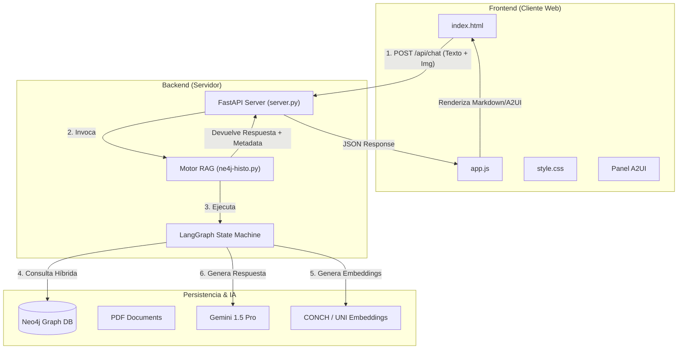

# RAG Histología Neo4j — Fullstack Edition

Sistema RAG (Retrieval-Augmented Generation) multimodal especializado en histología, que combina búsqueda vectorial y teoría de grafos (GraphRAG) para responder consultas complejas sobre tejidos, tinciones y morfología celular.

Esta versión **Fullstack** expone el motor RAG original (`ne4j-histo.py`) a través de una API moderna (FastAPI) y una interfaz de chat web (A2UI) con soporte para imágenes y renderizado enriquecido.

## 🏗️ Arquitectura del Sistema

El sistema sigue una arquitectura cliente-servidor desacoplada, donde el backend wrappea el motor de IA existente sin modificar su núcleo.



---

## 💻 Frontend (Cliente)

El cliente es una SPA (Single Page Application) ligera construida con Vanilla JS, HTML5 y CSS3 moderno (Glassmorphism). No requiere frameworks complejos ni compilación.

### Componentes Principales

1.  **`index.html`**:
    *   Estructura semántica de la aplicación.
    *   Contiene el área de chat, barra de entrada (sticky), paneles laterales (Temario, A2UI) y pantalla de bienvenida.
    *   Usa clases utilitarias para el layout y la tipografía.

2.  **`style.css`**:
    *   **Tema:** Dark mode premium con paleta violeta/cyan (`#7c3aed`, `#06b6d4`).
    *   **Efectos:** Glassmorphism (fondos translúcidos con `backdrop-filter: blur`), sombras suaves, y micro-animaciones (fade-in, slide-up).
    *   **Responsividad:** Diseño fluido que se adapta a escritorio y móvil.

3.  **`app.js`**:
    *   **Gestión de Estado:** Maneja la imagen activa en base64, el historial de chat y el estado de carga.
    *   **Comunicación API:**
        *   Envía peticiones paralelas a `/api/chat` (para texto) y `/api/chat/a2ui` (para JSON estructurado).
        *   Maneja errores y estados de "escribiendo..." (typing indicator).
    *   **Renderizado Markdown:** Convierte la respuesta del LLM (con tablas, listas, código) a HTML seguro.
    *   **Protocolo A2UI:** Visualiza la respuesta en formato JSON crudo para depuración o integración con otros agentes A2A.

---

## ⚙️ Backend (Servidor)

El servidor está construido con **FastAPI** y actúa como un wrapper alrededor del script original `ne4j-histo.py`.

### Archivos Clave

1.  **`server.py`**:
    *   **Importación Dinámica:** Usa `importlib` para cargar `ne4j-histo.py` como un módulo, permitiendo usar su clase `AsistenteHistologiaNeo4j` sin modificar el código original.
    *   **Endpoints REST:**
        *   `POST /api/chat`: Endpoint principal. Recibe `{query, image_base64}`. Guarda la imagen temporalmente, invoca al asistente, y devuelve la respuesta junto con metadatos (trayectoria, estructura identificada).
        *   `POST /api/chat/a2ui`: Similar al anterior, pero devuelve la respuesta formateada en el protocolo **A2UI** (Abstract Application User Interface), útil para interoperabilidad con agentes de Google.
        *   `GET /api/temario`: Devuelve la lista de temas extraídos de los PDFs.
        *   `GET /api/status`: Estado de salud del sistema y del grafo.
    *   **Archivos Estáticos:** Sirve el frontend (`client/`) en la ruta raíz `/`.

2.  **`ne4j-histo.py` (Core RAG)**:
    *   **LangGraph:** Orquestador del flujo de razonamiento (Planificar → Buscar → Refinar → Responder).
    *   **Multimodal:** Integra modelos de visión (CONCH, UNI) para entender imágenes histológicas y buscar similares en la base de datos vectorial.
    *   **Neo4j:** Almacena el conocimiento en un grafo de conocimiento (Nodos: Texto, Imagen, Entidad).

---

## 🚀 Cómo Ejecutar

### Prerrequisitos
*   Python 3.10+
*   Neo4j Database (corriendo local o en AuraDB)
*   Variables de entorno configuradas en `.env` (Google API Key, Neo4j credenciales).

### Opción 1: Desarrollo (con Hot-Reload)
Recomendado. Usa `uvicorn` para reiniciar el servidor al detectar cambios.

```bash
npm run dev
# O directamente:
# uv run uvicorn server:app --reload --host 0.0.0.0 --port 10005
```

Acceder a: **http://localhost:10005**

### Opción 2: Producción
Ejecuta el servidor con el intérprete de Python directamente.

```bash
uv run python server.py
```

### Opción 3: Modo CLI (Legacy)
El modo interactivo original por consola sigue funcionando:

```bash
uv run python ne4j-histo.py --interactivo
```
